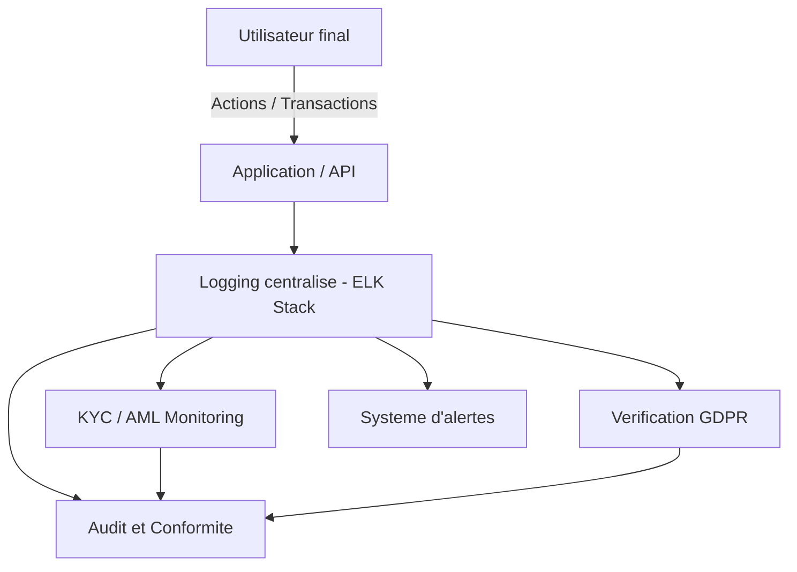

# 🔐 Audit, Conformité & Traçabilité : GDPR-KYC-AML

## Objectif
Ce module assure la **traçabilité et la conformité** du système aux normes **GDPR**, **KYC** et **AML**.  
Il centralise les logs, génère des rapports de conformité et permet de vérifier les droits des utilisateurs.

---

## ♻️ Flux global

---

## 🧩 Fonctionnalités principales

1. **Centralisation des logs**
   - Collecte des accès, transactions et modifications
   - Stockage dans **ELK Stack** (Elasticsearch, Logstash, Kibana)
   - Alertes en cas d’activité suspecte

2. **Rapports de conformité**
   - AML (transactions suspectes)
   - KYC (validité des documents)
   - GDPR (droit à l’oubli, anonymisation)

3. **Sécurité**
   - Chiffrement des données sensibles avec AES-256
   - TLS pour les communications réseau
   - Masquage ou hachage des PII

4. **Audits**
   - Historique complet des actions sensibles
   - Export PDF/CSV pour audits internes ou externes
   - Tableau de bord interactif avec Kibana

---
## 📂 Structure du projet
```bash
project_root/
│
├── config/
│   ├── logging.yaml
│   ├── elk_config.yaml
│   ├── gdpr_config.yaml
│   └── compliance_rules.yaml
│
├── src/
│   ├── __init__.py
│   │
│   ├── audit/
│   │   ├── __init__.py
│   │   ├── log_collector.py
│   │   ├── log_formatter.py
│   │   ├── elk_connector.py
│   │   ├── audit_report_generator.py
│   │   └── alerting_system.py
│   │
│   ├── compliance/
│   │   ├── __init__.py
│   │   ├── aml_monitor.py
│   │   ├── kyc_audit.py
│   │   ├── gdpr_verification.py
│   │   ├── anonymization_utils.py
│   │   └── compliance_dashboard.py
│   │
│   ├── security/
│   │   ├── encryption_utils.py
│   │   ├── key_management.py
│   │   └── tls_config.py
│   │
│   └── utils/
│       ├── file_handler.py
│       ├── email_notifier.py
│       ├── pdf_exporter.py
│       └── csv_exporter.py
│
├── dashboards/
│   ├── kibana/
│   │   ├── audit_dashboard.json
│   │   ├── aml_kyc_dashboard.json
│   │   └── gdpr_dashboard.json
│   └── screenshots/
│       └── ...
│
├── tests/
│   ├── test_audit/
│   │   ├── test_log_collector.py
│   │   ├── test_audit_report_generator.py
│   │   └── test_alerting_system.py
│   │
│   ├── test_compliance/
│   │   ├── test_aml_monitor.py
│   │   ├── test_kyc_audit.py
│   │   ├── test_gdpr_verification.py
│   │   └── test_anonymization_utils.py
│   │
│   └── test_security/
│       ├── test_encryption_utils.py
│       └── test_tls_config.py
│
├── logs/
│   ├── access_logs/
│   │   ├── access_2025-10-14.log
│   │   └── ...
│   ├── compliance_logs/
│   │   ├── aml_alerts.log
│   │   ├── gdpr_events.log
│   │   └── kyc_exceptions.log
│   └── system_events.log
│
├── reports/
│   ├── aml_report_2025Q4.pdf
│   ├── kyc_report_2025Q4.pdf
│   ├── gdpr_audit_2025Q4.csv
│   └── compliance_summary.json
│
├── scripts/
│   ├── run_elasticsearch.sh
│   ├── deploy_kibana_dashboard.sh
│   ├── generate_audit_reports.py
│   └── gdpr_cleanup_job.py
│
└── README.md
```

---

## ⚙️ Installation

```bash
# Installer les dépendances Python
pip install -r requirements.txt

# Lancer Elasticsearch et Kibana
./scripts/run_elasticsearch.sh
./scripts/deploy_kibana_dashboard.sh
```
