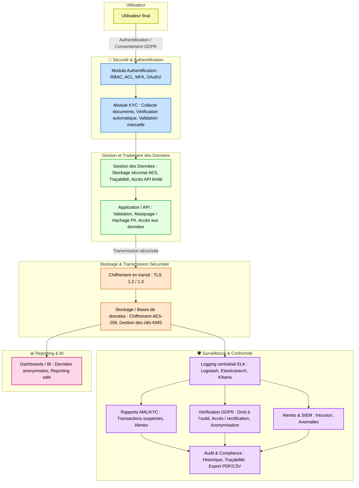
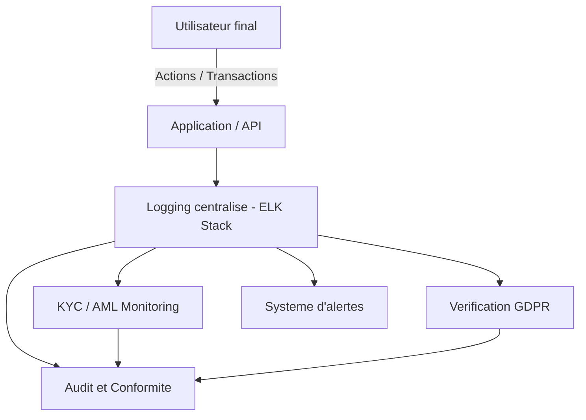

# 🔐 Audit, Conformité & Traçabilité : GDPR-KYC-AML

## Objectif
Ce module assure la **traçabilité et la conformité** du système aux normes **GDPR**, **KYC** et **AML**.  
Il centralise les logs, génère des rapports de conformité et permet de vérifier les droits des utilisateurs.

---

## ♻️ Flux global


---

## 🧩 Fonctionnalités principales

1. **Centralisation des logs**
   - Collecte des accès, transactions et modifications
   - Stockage dans **ELK Stack** (Elasticsearch, Logstash, Kibana)
   - Alertes en cas d’activité suspecte

2. **Rapports de conformité**
   - AML (transactions suspectes)
   - KYC (validité des documents)
   - GDPR (droit à l’oubli, anonymisation)

3. **Sécurité**
   - Chiffrement des données sensibles avec AES-256
   - TLS pour les communications réseau
   - Masquage ou hachage des PII

4. **Audits**
   - Historique complet des actions sensibles
   - Export PDF/CSV pour audits internes ou externes
   - Tableau de bord interactif avec Kibana
---

---
## 📂 Structure du projet
```bash
project_root/
│
├── config/
│   ├── logging.yaml  # Paramètres et format des logs centralisés
│   ├── elk_config.yaml  # Configuration Elasticsearch / Logstash / Kibana
│   ├── gdpr_config.yaml  # Champs et règles relatifs au GDPR (droit à l’oubli, anonymisation)
│   └── compliance_rules.yaml  # Règles AML/KYC, seuils et critères d’alerte
│
├── src/
│   ├── __init__.py
│
│   ├── audit/
│   │   ├── __init__.py
│   │   ├── log_collector.py  # Collecte des logs depuis API, DB et systèmes
│   │   ├── log_formatter.py  # Normalisation et mise en forme des logs
│   │   ├── elk_connector.py  # Interface pour envoyer les logs vers Elasticsearch
│   │   ├── audit_report_generator.py  # Génération de rapports de conformité (PDF/CSV)
│   │   └── alerting_system.py  # Envoi d’alertes en cas d’activité suspecte
│
│   ├── compliance/
│   │   ├── __init__.py
│   │   ├── aml_monitor.py  # Surveillance des transactions suspectes (AML)
│   │   ├── kyc_audit.py  # Vérification de la validité et complétude des documents KYC
│   │   ├── gdpr_verification.py  # Contrôle du droit à l’oubli et anonymisation GDPR
│   │   ├── anonymization_utils.py  # Fonctions pour pseudonymisation/anonymisation
│   │   └── compliance_dashboard.py  # Génération des dashboards de conformité
│
│   ├── security/
│   │   ├── encryption_utils.py  # Fonctions de chiffrement/déchiffrement AES-256
│   │   ├── key_management.py  # Gestion sécurisée des clés (KMS ou local)
│   │   └── tls_config.py  # Configuration TLS pour la communication réseau
│
│   └── utils/
│       ├── file_handler.py  # Lecture/écriture sécurisée de fichiers
│       ├── email_notifier.py  # Envoi de mails pour alertes et rapports
│       ├── pdf_exporter.py  # Export des rapports en PDF
│       └── csv_exporter.py  # Export des rapports en CSV
│
├── dashboards/
│   ├── kibana/
│   │   ├── audit_dashboard.json  # Dashboard des logs et audits
│   │   ├── aml_kyc_dashboard.json  # Dashboard de suivi KYC/AML
│   │   └── gdpr_dashboard.json  # Dashboard GDPR (suppression, anonymisation)
│   └── screenshots/  # Captures d’écran des dashboards pour documentation
│       └── ...
│
├── tests/
│   ├── test_audit/
│   │   ├── test_log_collector.py  # Test de collecte des logs
│   │   ├── test_audit_report_generator.py  # Test de génération de rapports
│   │   └── test_alerting_system.py  # Test du système d’alertes
│   │
│   ├── test_compliance/
│   │   ├── test_aml_monitor.py  # Test des règles AML
│   │   ├── test_kyc_audit.py  # Test des vérifications KYC
│   │   ├── test_gdpr_verification.py  # Test du respect GDPR
│   │   └── test_anonymization_utils.py  # Test des fonctions d’anonymisation
│   │
│   └── test_security/
│       ├── test_encryption_utils.py  # Test du chiffrement/déchiffrement
│       └── test_tls_config.py  # Test des configurations TLS
│
├── logs/
│   ├── access_logs/
│   │   ├── access_2025-10-14.log  # Logs d’accès utilisateurs
│   │   └── ...
│   ├── compliance_logs/
│   │   ├── aml_alerts.log  # Alertes AML
│   │   ├── gdpr_events.log  # Logs GDPR (droit à l’oubli, anonymisation)
│   │   └── kyc_exceptions.log  # Exceptions KYC
│   └── system_events.log  # Logs systèmes généraux
│
├── reports/
│   ├── aml_report_2025Q4.pdf  # Rapport AML
│   ├── kyc_report_2025Q4.pdf  # Rapport KYC
│   ├── gdpr_audit_2025Q4.csv  # Rapport GDPR
│   └── compliance_summary.json  # Résumé des audits et conformité
│
├── scripts/
│   ├── run_elasticsearch.sh  # Lancement du cluster Elasticsearch
│   ├── deploy_kibana_dashboard.sh  # Déploiement automatique des dashboards
│   ├── generate_audit_reports.py  # Génération automatisée des rapports
│   └── gdpr_cleanup_job.py  # Suppression/anonymisation périodique GDPR
│
└── README.md  # Documentation globale du module Audit & Conformité
```

---

## ⚙️ Installation

```bash
# Installer les dépendances Python
pip install -r requirements.txt

# Lancer Elasticsearch et Kibana
./scripts/run_elasticsearch.sh
./scripts/deploy_kibana_dashboard.sh
```
