# 🔐 Audit, Conformité & Traçabilité : GDPR-KYC-AML

## Objectif
Ce module assure la **traçabilité et la conformité** du système aux normes **GDPR**, **KYC** et **AML**.  
Il centralise les logs, génère des rapports de conformité et permet de vérifier les droits des utilisateurs.

---

## ♻️ Flux global

```mermaid
flowchart TD
    %% === STYLES ===
    classDef user fill:#f9f9b3,stroke:#b3b300,stroke-width:2px,color:#000;
    classDef auth fill:#c6e2ff,stroke:#0066cc,stroke-width:1.5px,color:#000;
    classDef data fill:#e2ffe2,stroke:#009933,stroke-width:1.5px,color:#000;
    classDef storage fill:#ffe6cc,stroke:#cc6600,stroke-width:1.5px,color:#000;
    classDef monitoring fill:#f0d9ff,stroke:#8000ff,stroke-width:1.5px,color:#000;
    classDef report fill:#ffd6e7,stroke:#b30059,stroke-width:1.5px,color:#000;

    %% === UTILISATEUR ===
    subgraph U[👤 Utilisateur]
        User[Utilisateur final]
    end
    class User user;

    %% === SÉCURITÉ & AUTHENTIFICATION ===
    subgraph S[🔐 Sécurité & Authentification]
        Auth[Module Authentification : RBAC, ACL, MFA, OAuth2]
        KYC[Module KYC : Collecte documents, Vérification automatique, Validation manuelle]
    end
    class Auth,KYC auth;

    %% === TRAITEMENT DES DONNÉES ===
    subgraph D[🧩 Gestion et Traitement des Données]
        Data[Gestion des Données : Stockage sécurisé AES, Traçabilité, Accès API limité]
        App[Application / API : Validation, Masquage / Hachage PII, Accès aux données]
    end
    class Data,App data;

    %% === STOCKAGE & TRANSMISSION ===
    subgraph T[💾 Stockage & Transmission Sécurisée]
        TLS[Chiffrement en transit : TLS 1.2 / 1.3]
        DB[Stockage / Bases de données : Chiffrement AES-256, Gestion des clés KMS]
    end
    class TLS,DB storage;

    %% === SURVEILLANCE & CONFORMITÉ ===
    subgraph M[🛡️ Surveillance & Conformité]
        Logs[Logging centralisé ELK : Logstash, Elasticsearch, Kibana]
        AML[Rapports AML/KYC : Transactions suspectes, Alertes]
        GDPRCheck[Vérification GDPR : Droit à l’oubli, Accès / rectification, Anonymisation]
        Alerts[Alertes & SIEM : Intrusion, Anomalies]
        Audit[Audit & Compliance : Historique, Traçabilité, Export PDF/CSV]
    end
    class Logs,AML,GDPRCheck,Alerts,Audit monitoring;

    %% === REPORTING ===
    subgraph R[📊 Reporting & BI]
        BI[Dashboards / BI : Données anonymisées, Reporting safe]
    end
    class BI report;

    %% === FLUX DE DONNÉES ===
    User -->|Authentification / Consentement GDPR| Auth
    Auth --> KYC
    KYC --> Data
    Data --> App
    App -->|Transmission sécurisée| TLS
    TLS --> DB

    DB --> Logs
    DB --> BI

    Logs --> AML
    Logs --> GDPRCheck
    Logs --> Alerts

    AML --> Audit
    GDPRCheck --> Audit
    Alerts --> Audit
```


---


---

## 🧩 Fonctionnalités principales

1. **Centralisation des logs**
   - Collecte des accès, transactions et modifications
   - Stockage dans **ELK Stack** (Elasticsearch, Logstash, Kibana)
   - Alertes en cas d’activité suspecte

2. **Rapports de conformité**
   - AML (transactions suspectes)
   - KYC (validité des documents)
   - GDPR (droit à l’oubli, anonymisation)

3. **Sécurité**
   - Chiffrement des données sensibles avec AES-256
   - TLS pour les communications réseau
   - Masquage ou hachage des PII

4. **Audits**
   - Historique complet des actions sensibles
   - Export PDF/CSV pour audits internes ou externes
   - Tableau de bord interactif avec Kibana

---
## 📂 Structure du projet
```bash
project_root/
│
├── config/
│   ├── logging.yaml
│   ├── elk_config.yaml
│   ├── gdpr_config.yaml
│   └── compliance_rules.yaml
│
├── src/
│   ├── __init__.py
│   │
│   ├── audit/
│   │   ├── __init__.py
│   │   ├── log_collector.py
│   │   ├── log_formatter.py
│   │   ├── elk_connector.py
│   │   ├── audit_report_generator.py
│   │   └── alerting_system.py
│   │
│   ├── compliance/
│   │   ├── __init__.py
│   │   ├── aml_monitor.py
│   │   ├── kyc_audit.py
│   │   ├── gdpr_verification.py
│   │   ├── anonymization_utils.py
│   │   └── compliance_dashboard.py
│   │
│   ├── security/
│   │   ├── encryption_utils.py
│   │   ├── key_management.py
│   │   └── tls_config.py
│   │
│   └── utils/
│       ├── file_handler.py
│       ├── email_notifier.py
│       ├── pdf_exporter.py
│       └── csv_exporter.py
│
├── dashboards/
│   ├── kibana/
│   │   ├── audit_dashboard.json
│   │   ├── aml_kyc_dashboard.json
│   │   └── gdpr_dashboard.json
│   └── screenshots/
│       └── ...
│
├── tests/
│   ├── test_audit/
│   │   ├── test_log_collector.py
│   │   ├── test_audit_report_generator.py
│   │   └── test_alerting_system.py
│   │
│   ├── test_compliance/
│   │   ├── test_aml_monitor.py
│   │   ├── test_kyc_audit.py
│   │   ├── test_gdpr_verification.py
│   │   └── test_anonymization_utils.py
│   │
│   └── test_security/
│       ├── test_encryption_utils.py
│       └── test_tls_config.py
│
├── logs/
│   ├── access_logs/
│   │   ├── access_2025-10-14.log
│   │   └── ...
│   ├── compliance_logs/
│   │   ├── aml_alerts.log
│   │   ├── gdpr_events.log
│   │   └── kyc_exceptions.log
│   └── system_events.log
│
├── reports/
│   ├── aml_report_2025Q4.pdf
│   ├── kyc_report_2025Q4.pdf
│   ├── gdpr_audit_2025Q4.csv
│   └── compliance_summary.json
│
├── scripts/
│   ├── run_elasticsearch.sh
│   ├── deploy_kibana_dashboard.sh
│   ├── generate_audit_reports.py
│   └── gdpr_cleanup_job.py
│
└── README.md
```

---

## ⚙️ Installation

```bash
# Installer les dépendances Python
pip install -r requirements.txt

# Lancer Elasticsearch et Kibana
./scripts/run_elasticsearch.sh
./scripts/deploy_kibana_dashboard.sh
```
