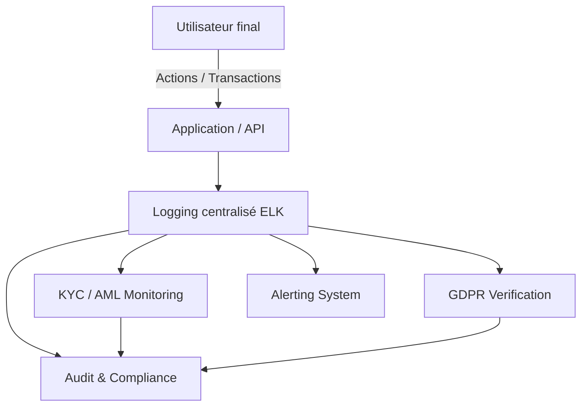

# Module Audit & Conformité

Ce module assure la **sécurité, conformité et traçabilité** des données sensibles.  
Il couvre le suivi des accès, la surveillance AML/KYC, le respect du **GDPR**, le chiffrement et les alertes.

## Fonctionnalités principales

- **Sécurité** : Chiffrement AES‑256, gestion des clés, TLS pour les communications.
- **Audit et traçabilité** : Collecte centralisée des logs, génération de rapports PDF/CSV.
- **Conformité AML/KYC** : Surveillance des transactions suspectes et des documents clients.
- **Respect GDPR** : Droit à l’oubli, anonymisation des données, suppression périodique.
- **Alerting** : Notifications en cas d’activité suspecte ou non conforme.
- **Dashboards** : Visualisation centralisée dans Kibana (Audit / AML-KYC / GDPR).

## Exécution des scripts

```bash
# Lancer le cluster Elasticsearch + Kibana
./scripts/run_elasticsearch.sh

# Déployer les dashboards dans Kibana
./scripts/deploy_kibana_dashboard.sh

# Générer les rapports de conformité (PDF/CSV)
python3 ./scripts/generate_audit_reports.py

# Exécuter le job de nettoyage GDPR
python3 ./scripts/gdpr_cleanup_job.py
```

## Tests unitaires

```bash
# Tests audit
python3 -m unittest discover -s tests/test_audit

# Tests compliance
python3 -m unittest discover -s tests/test_compliance

# Tests sécurité
python3 -m unittest discover -s tests/test_security
```

## Diagramme du flux de conformité


